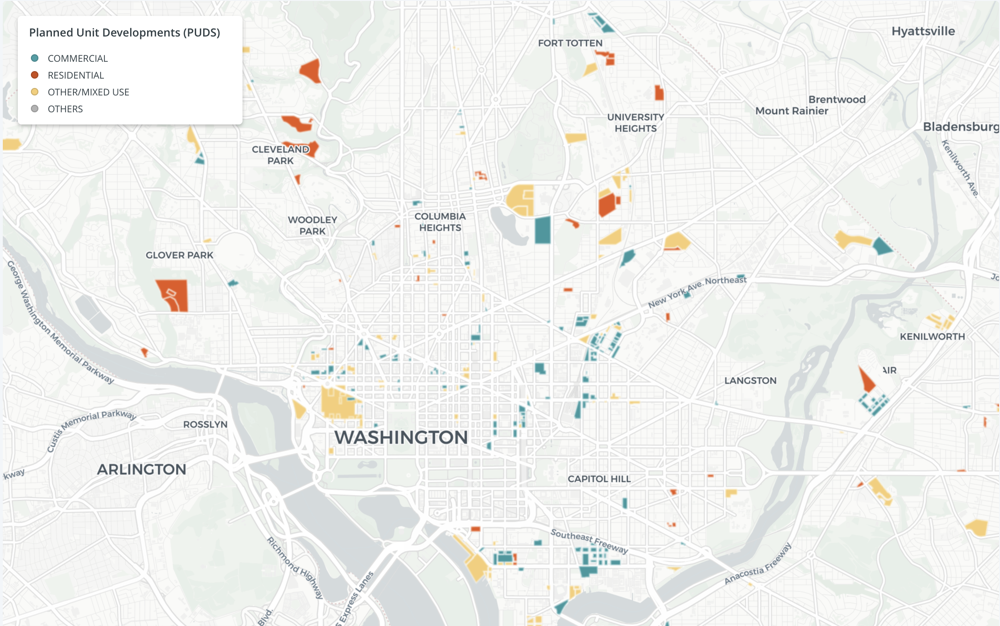

# Creating Zoning Maps Using Python & Pandas

This script is used to create a shapefile to map the distribution of Planned Unit Developments (PUDs) in Washington DC. The shapefile uses publically available data from Open Data DC (data was downloaded 11/6/20) to explore how PUDs have been zoned. 

This script uses a shapefile of the PUDs, a csv file of affordable housing, and a crosswalk file of the zoning categories to merge the two. This script outputs a table puds_info which includes the joined data from the three inputs. The information in this table is used to output all the shapefile components (.cpg, .dbf, .prj, .shp, .shx), which are all exported to a google drive folder to facilitate storage and future use of the shapefile. [This information was then mapped using Carto](https://annabebbington.carto.com/builder/52683599-68fc-4d88-8ad9-0e31e243d1cd/embed?state=%7B%22map%22%3A%7B%22ne%22%3A%5B38.82043438913452%2C-77.24574476480485%5D%2C%22sw%22%3A%5B39.01249821464344%2C-76.8804493546486%5D%2C%22center%22%3A%5B38.91653127795355%2C-77.06309705972673%5D%2C%22zoom%22%3A12%7D%2C%22widgets%22%3A%7B%22782266ab-5cb6-4f5d-b58b-7d1512262950%22%3A%7B%22collapsed%22%3Atrue%7D%7D%7D), in order to visualise the distribution of PUDs in DC. 

